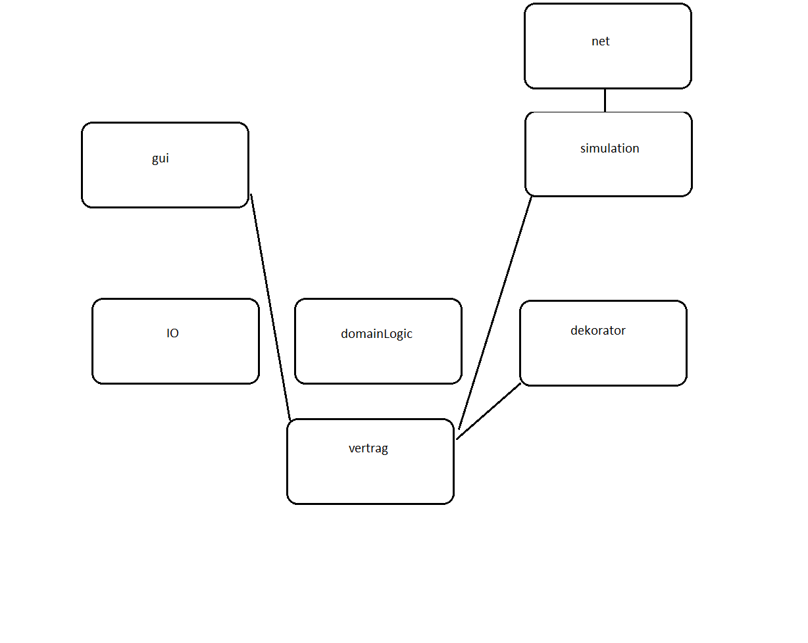

# Beleg PZR1 (94)
Checkboxen befüllen und _kursiv_ gesetzten Text durch entsprechende Angaben ersetzten.
Bei keiner Angabe wird nur Entwurf, Testqualität, Testabdeckung GL, Fehlerfreiheit und Basisfunktionalität bewertet.
Die Zahl in der Klammer sind die jeweiligen Punkte für die Bewertung.
Die empfohlenen Realisierungen zum Bestehen der Prüfung sind **fett** gesetzt.
Ergänzende Anmerkungen bitte immer _kursiv_ setzen. Andere Änderungen sind nicht zulässig.

## Entwurf (11)
- [x] **Schichtenaufteilung** (2)
- [ ] **Architekturdiagramm vollständig** (1)
- [ ] **Architekturdiagramm korrekt bzgl. source code** (1)
- [x] Zuständigkeit (2)
- [x] Paketierung (2)
- [x] Benennung (2)
- [x] keine Duplikate (1)

## Tests (28)
- [x] **Testqualität** (7)
- [ ] **Testabdeckung GL** (7) _Abdeckung in Prozent angeben_
- [x] **Testabdeckung Rest** (6) _60%_
  - [x] Einfügen von Herstellern über das CLI _src/CLI/ConsoleImp.java_
  - [x] Anzeigen von Herstellern über das CLI _src/CLI/ConsoleImp.java_
  - [ ] ein Beobachter bzw. dessen alternative Implementierung _getestete Klassen angeben_
  - [ ] deterministische Funktionalität der Simulationen _getestete Klassen angeben_
  - [x] Speichern via JOS oder JBP _src/IO/jos/SaveAndLoadJOS.java_
  - [x] Laden via JOS oder JBP _src/IO/jos/SaveAndLoadJOS.java_ (85%) (Exception for load are not tested)
- [x] **Mockito richtig verwendet** (4) 
- [x] Spy- / Verhaltens-Tests (3) 
- [x] keine unbeabsichtigt fehlschlagenden Test (1)

## Fehlerfreiheit (10)
- [x] **Kapselung** (5)
- [x] **keine Ablauffehler** (5)

## Basisfunktionalität (12)
- [x] **CRUD** (2)
- [x] **CLI** (2)
  * Syntax gemäß Anforderungen
- [x] **Simulation** (2)
  * ohne race conditions
- [x] **GUI** (2)
- [x] **I/O** (2)
  * in CLI oder GUI integriert (In CLI and GUI)
- [x] **Net** (2)

## Funktionalität (23)
- [ ] vollständige GL (2)
- [x] threadsichere GL (1)
- [x] vollständiges CLI (1)
- [ ] alternatives CLI (1)
  * _angeben welche Funktionalität im alternativen CLI deaktiviert_
- [x] skalierbare GUI (1)
- [x] vollständige GUI (1)
- [ ] ausdifferenziertes event-System mit mindestens 3 events (2)
- [ ] observer ^ property change propagation (2)
- [x] angemessene Aufzählungstypen (2)
- [ ] Simulation 2 (1)
- [ ] Simulation 3 (1)
- [ ] data binding verwendet (1)
- [ ] Änderung der Fachnummer mittels drag&drop (1)
- [x] Einfügen von Kuchen via GUI sperrt nicht (1)
- [x] JBP und JOS (2) 
- [x] TCP und UDP (1) 
- [ ] Server unterstützt konkurierende Clients für TCP oder UDP (2)

## zusätzliche Anforderungen (10)
- [ ] Kuchen nach Dekoratormuster (4)
- [ ] korrekte Aggregationen (2)
- [ ] Integration in CLI & GUI (4)

## Architekturdiagramm

